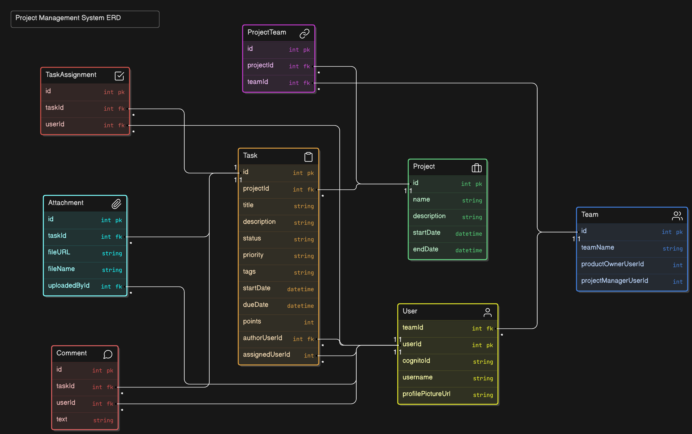

# Project Management Dashboard

## Technology Stack

### Frontend
- **Next.js**
- **Tailwind CSS**
- **Redux Toolkit**
- **Redux Toolkit Query**
- **Material UI Data Grid**

### Backend
- **Node.js** with Express
- **Prisma** (PostgreSQL ORM)

### Database
- **PostgreSQL**, managed with PgAdmin

### Cloud
- **AWS EC2**
- **AWS RDS**
- **AWS API Gateway**
- **AWS Amplify**
- **AWS S3**
- **AWS Lambda**
- **AWS Cognito**

---
## Data Model Diagram


## AWS Architecture Diagram


---

## Getting Started

### Installation Steps

1. **Clone the repository:**
   ```bash
   git clone
   cd project-management
    cd client
    npm install
    cd ..
    cd server
    npm install
    npx prisma generate
    npx prisma migrate dev --name init
    npm run seed
Configure environment variables:

.env for server settings (PORT, DATABASE_URL)
.env.local for client settings (NEXT_PUBLIC_API_BASE_URL)
npm run dev